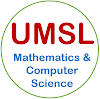

  

## Syllabus | Deep Learning - CMP SCI 4390/5390 | 2019 Spring

[UMSL Semester Calendar](https://www.umsl.edu/~registration/students/semester-calendars-important-dates.html) | [Student Resources & Support](https://umsl.instructure.com/courses/44471/pages/student-resources-and-supports?module_item_id=454221) |  [Technology Assistance](https://umsl.instructure.com/courses/44471/pages/technology-assistance?module_item_id=454223) | [UMSL Final Exam Schedule](http://www.umsl.edu/~registration/students/final-exam-schedule-fall-2018-updated.pdf)  

## About the Instructor
* Name: Dr. Badri Adhikari
* Email: adhikarib@umsl.edu (Use your UMSL email account to send me emails)
* Office Hours: TuTh 2 PM to 4 PM
* Office Location: 312 ESH
* Homepage: [https://badriadhikari.github.io](https://badriadhikari.github.io)

## About this Course
**Prerequisites**
* CMP SCI 3130 or Graduate Standing in CS

**Description**
* This course reviews a typical machine learning recipe, mathematical foundations for deep learning, and provides an introduction to deep learning. Topics include dense neural networks, convolutional neural networks, and recurrent neural networks. The course will cover building, training, and using deep neural networks for solving various machine learning problems like image classification and protein contact prediction. Credit cannot be granted for both CMP SCI 4390 and CMP SCI 5390. \[3 credit units\].

* Deep learning is rapidly becoming popular because of its high applicability and superior performance in almost all domains where we have been applying machine learning. Deep learning based applications have reached or surpassed human performance not only for industrial problems like object classification and speech recognition but also for many problems in the field of biology and medicine. For instance, recently deep learning is demonstrated to outperform human radiologists in detecting pneumonia from chest X-rays.

**This course aims to** 
* Revise the recipe for machine learning and introduce deep learning
* Explain what makes deep learning powerful compared to traditional machine learning methods 
* Cover the basic mathematical foundations of deep learning such as vector operations 
* Introduce the various flavors of deep learning such as dense neural networks, convolutional neural networks, and recurrent neural networks 
* Delve into building, training, and using deep neural networks for solving various machine learning problems such as image classification and protein contact prediction
* Cover how a deep learning architecture actually works and how to debug 

**Upon completing the course students will be able to (Learning Outcomes):** 
* Learn mathematical foundations for deep learning 
* Learn the major technology trends in deep learning 
* Understand what makes deep learning different from traditional machine learning 
* Understand the parameters in a deep neural network architecture 
* Build, train, and use deep neural networks efficiently

**Class meets**
* TuTh 4 PM to 5:15 PM at SSB 218

**Course Materials**
* Syllabus, Slides, Project Requirements, Tests, and Samples are inside the relevant folders

**Textbooks**
* "Deep Learning with Python" by François Chollet     
* "Machine Learning Yearning" by Andrew Ng     
* "Deep Learning by Ian Goodfellow, Yoshua Bengio, and Aaron Courville     

## Course Topics, Schedule & Deadlines

`Week` | `Day` | `Date` | `Topic` | `Slides Covered`
--- | --- | --- | --- | ---
  | 1 | Jan 15, Tue | A quick intro to Dense NNs and CNNs | BasicIntro 1-15 ||
1 | 1 | Jan 15, Tue | A quick intro to Dense NNs and CNNs | BasicIntro 1-15 |
  | 1 | Jan 15, Tue | A quick intro to Dense NNs and CNNs | BasicIntro 1-15 ||
2 | 1 | Jan 15, Tue | A quick intro to Dense NNs and CNNs | BasicIntro 1-15 |

## Course Policies
**General**
* Keep yourself out of plagarism - Read [UMSL's Policy](https://www.umsl.edu/services/academic/policy/academic-dishonesty.html)
* Lecture recordings, audio or video, are not permitted

**Tests** 
* There will be one Mid-term Coding Test
* Test will be closed book and closed notes
* Use of any type of electronics is strictly forbidden during tests

**Attendance**  
* Attendance will be recorded in every class
* You will automatically fail the course if you miss more than 4 classes

## Assessment/Grading
**Grade Composition (4300 - Undergraduate)**
* 70 points = Mid-term Test
* 30 points = Final Project

**Grading Scale**
* A for >= 90% 
* B for >= 80%
* C for >= 70%
* D for >=60%
* F for < 60% 
